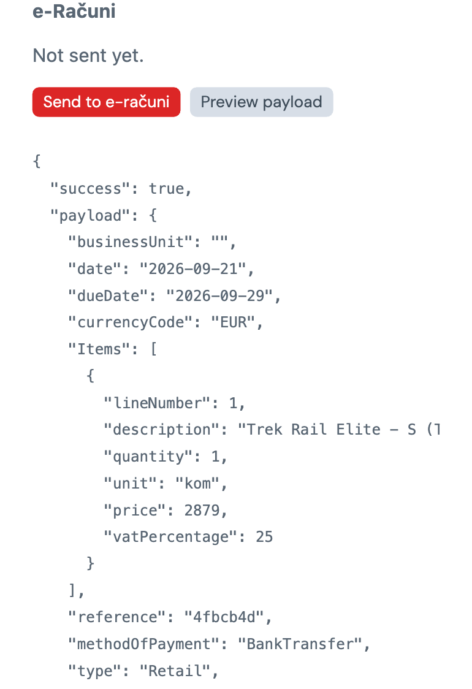
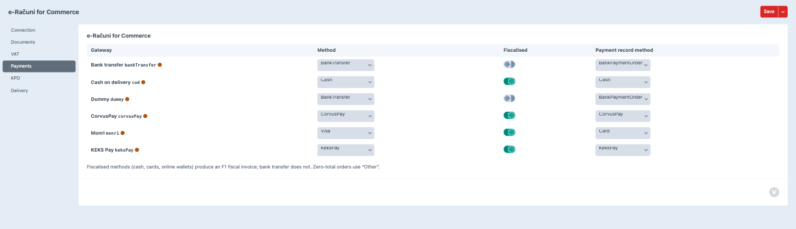
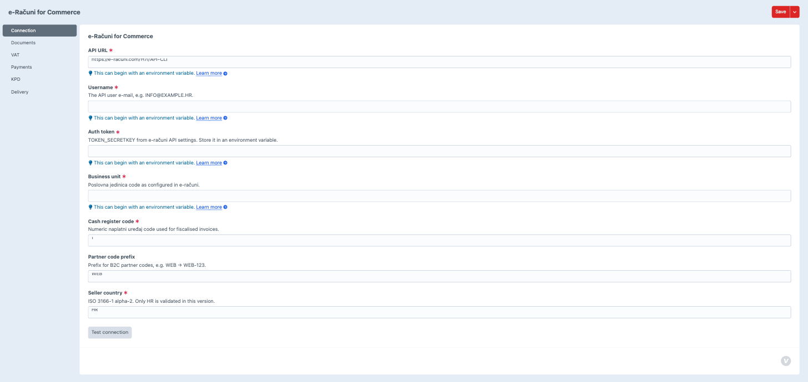
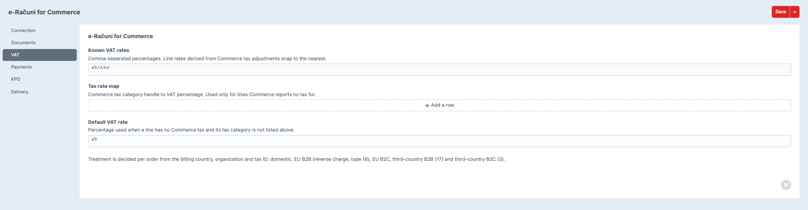
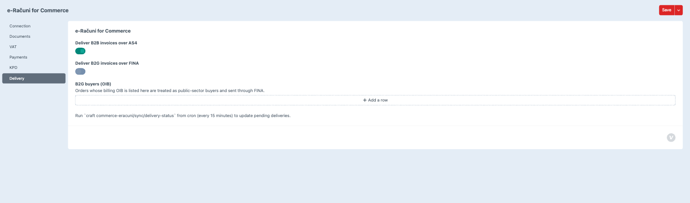

# e-Računi for Commerce

A Craft Commerce 5 plugin that sends completed orders to [e-računi.hr](https://e-racuni.com/) as
invoices: fiscalisation (F1), VAT treatment, KPD codes, and AS4/FINA e-invoice delivery.

## What it does

When a Commerce order reaches a configured status (and is optionally fully paid), the plugin
builds an e-računi invoice from the order — buyer, line items, VAT treatment, payment method —
and sends it through the e-računi REST API. The resulting document (invoice number, PDF, VAT
treatment, delivery status) is stored locally and surfaced:

- on the order edit page, as a read-only panel with a manual "Send to e-računi" / "Preview
  payload" action;
- under **e-Računi → Documents** in the control panel, a filterable list of every document with a
  retry action for failed sends;
- to Twig, via `craft.commerceEracuni`;
- to the console, via `craft commerce-eracuni/sync/*` commands for status checks, manual sends,
  backfilling, retries, and delivery-status polling.

The plugin decides, per order, whether the invoice is B2C, domestic B2B, EU B2B (reverse charge),
EU B2C, or third-country B2B/B2C, and whether it needs fiscalisation, based on the payment method
and the buyer's billing country/organisation/tax ID.

## Requirements

- Craft CMS `^5.3`
- Craft Commerce `^5.0`
- PHP `^8.2`
- An e-računi.hr account with API access enabled

## Installation

```bash
composer require wmd/craft-commerce-eracuni
craft plugin/install commerce-eracuni
```

## Configuration

### Connection (`.env`)

The Connection settings tab is built with `suggestEnvVars`, so every field can hold an environment
variable reference (`$VAR_NAME`) instead of a literal value. Add these to your `.env`:

```
ERACUNI_API_URL=https://e-racuni.com/H7i/API-CLI
ERACUNI_USERNAME=info@example.hr
ERACUNI_TOKEN=your-token-secretkey
ERACUNI_BUSINESS_UNIT=your-poslovna-jedinica-code
```

Then, in **Settings → e-Računi → Connection**, set:

| Field         | Value              |
|---------------|--------------------|
| API URL       | `$ERACUNI_API_URL` |
| Username      | `$ERACUNI_USERNAME` |
| Auth token    | `$ERACUNI_TOKEN` |
| Business unit | `$ERACUNI_BUSINESS_UNIT` |

Also set the numeric cash register code (`naplatni uređaj`) used for fiscalised invoices, an
optional partner-code prefix for B2C partners (e.g. `WEB` → `WEB-123`), and the seller country
(only `HR` is validated in this version). Use **Test connection** on the same tab to verify the
credentials against the e-računi API before enabling auto-send.

### Settings tabs

- **Connection** — API URL, username, auth token, business unit, cash register code, partner code
  prefix, seller country.
- **Documents** — auto-send on/off, which order statuses trigger a send, whether the order must be
  fully paid first, invoice date source (date of sending vs. order date), payment due days, and
  whether to record a payment on the e-računi invoice for orders already paid.
- **VAT** — the known VAT rates, the tax rate map and the default VAT rate (below), plus a
  read-only explanation of how VAT treatment is decided.
- **Payments** — the payment-method mapping table (below), per Commerce gateway.
- **KPD** — the KPD field handle and defaults (below).
- **Delivery** — AS4/FINA delivery toggles, the B2G buyer OIB list, and the cron reminder for
  delivery-status polling.

### VAT rates

Line VAT rates are derived from Commerce's own tax adjustments: the plugin divides the line's tax
by its net amount and snaps the result to the nearest of the **Known VAT rates** (comma-separated,
default `25,13,5,0`). The shipping line takes its rate from the order-level tax adjustment, not
from the first line, so a mixed-rate basket does not deliver at the reduced rate.

Two settings cover the case where Commerce reports no tax at all for a line — no tax engine
configured, or a tax rule that does not match:

- **Tax rate map** — Commerce tax category handle to VAT percentage, e.g. `books` to `5`. Consulted
  only when the line carries no tax adjustment.
- **Default VAT rate** — used when the line's tax category is not in the map (default `25`).

In both cases the line's Commerce price is read as VAT-inclusive (gross) and the net is derived
from it. A domestic invoice line that still ends up at 0% is flagged as a warning in the preview
and on the document record, because that is nearly always a missing tax rule rather than a genuine
exemption.

### Payment method mapping

Each Commerce gateway is mapped to an e-računi payment method, whether it fiscalises the invoice,
and the payment method recorded against the invoice. New gateways get a suggested mapping (based
on their handle/class name) that you confirm and save on the **Payments** settings tab; the
mapping itself lives in `src/core/PaymentMethodMap.php`.

| e-računi method       | Fiscalised | Payment record method |
|------------------------|:----------:|------------------------|
| Cash                    | Yes | Cash |
| Visa                    | Yes | Card |
| EurocardMastercard      | Yes | Card |
| Diners                  | Yes | Card |
| Amex                    | Yes | Card |
| Stripe                  | Yes | Stripe |
| PayPal                  | Yes | PayPal |
| CorvusPay               | Yes | CorvusPay |
| KeksPay                 | Yes | KeksPay |
| BankTransfer            | No  | BankPaymentOrder |
| Compensation            | No  | Compensation |
| Other                   | No  | BankPaymentOrder |

Fiscalised methods (cash, cards, online wallets) produce an F1 fiscal invoice; bank transfer does
not. Zero-total orders (e.g. fully discounted) use "Other". A gateway with no explicit mapping
falls back to `BankTransfer`.

### KPD field setup

e-računi line items carry a KPD (Klasifikacija proizvoda po djelatnostima) code. The plugin reads
it from:

1. a Plain Text field on the variant or product — the handle is configurable on the **KPD**
   settings tab, defaulting to `kpd`;
2. falling back to a per-product-type default, also set on that tab;
3. falling back to a single global default KPD.

Create the `kpd` Plain Text field (or whatever handle you configure) on your product/variant field
layouts before enabling auto-send, and fill in per-product-type or global defaults for products
that don't carry their own code.

Shipping lines use a separate **Shipping KPD** setting, defaulting to `532000` (postal and courier
activities). That default is a suggestion only — confirm the correct code with your accountant
before relying on it.

### Delivery (AS4 / FINA)

- **Deliver B2B invoices over AS4** — sends B2B e-invoices through the AS4 network (on by default).
- **Deliver B2G invoices over FINA** — sends invoices to public-sector buyers through FINA.
- **B2G buyers (OIB)** — list of buyer OIBs treated as public-sector (FINA) regardless of the
  organisation field.

Delivery status (AS4/FINA) isn't known synchronously at send time — poll for it with the
`sync/delivery-status` console command. Add it to cron:

```
*/15 * * * * php craft commerce-eracuni/sync/delivery-status
```

(adjust the `php`/`craft` paths for your server; see the polling rate-limit note in
`src/services/DeliverySync.php` — one status read per second per batch.)

### Console commands

All commands are under `commerce-eracuni/sync/`:

- `craft commerce-eracuni/sync/status` — connection check plus a count of documents by status.
- `craft commerce-eracuni/sync/order <idOrNumber>` — send one order synchronously, under the send
  mutex; accepts an order ID, number, or reference.
- `craft commerce-eracuni/sync/backfill [--dry-run] [--limit=50] [--since=YYYY-MM-DD]` — queues
  every completed order matching the trigger conditions that has no document yet (e.g. orders
  placed before the plugin was installed).
- `craft commerce-eracuni/sync/retry [--all] [--limit=50]` — re-queues failed documents.
- `craft commerce-eracuni/sync/delivery-status [--limit=100]` — refreshes pending AS4/FINA
  delivery statuses; this is the one to run from cron.

### Twig usage

```twig


    Račun {{ doc.number }} — <a href="{{ doc.pdfUrl }}">PDF</a>

```

`documentForOrder()` accepts either a `craft\commerce\elements\Order` or a raw order ID, and
returns a `wmd\commerceeracuni\models\Document` (or `null` if nothing has been sent yet) with
`number`, `status`, `treatment`, `deliveryStatus`, `pdfUrl`, and `isSent()`.

**PDF links are CP-only in 1.0.** `Document::getPdfUrl()` returns a control-panel action URL
(`commerce-eracuni/documents/pdf`) gated by the plugin's manage-documents permission — it is not a
signed or tokenised URL, and the PDF itself never lives under the web root. The link only works for
a logged-in CP user with the "Send, preview and retry e-računi documents" permission; there is no
public front-end download route in this version.

## Legal notes

- **Fiscalisation** (the F1 fiscal invoice, cash register code, etc.) applies only to cash-like
  payment methods (cash, cards, online wallets) per Croatian fiscalisation law — not to bank
  transfers or other non-cash settlement.
- **B2B e-invoicing over the AS4 network is mandatory in Croatia from 1 January 2026** for
  business-to-business transactions. The **Deliver B2B invoices over AS4** setting is on by
  default for this reason.
- **B2G (business-to-government) e-invoicing goes through FINA**, not AS4. Configure buyer OIBs
  that should be treated as public-sector on the Delivery settings tab.

None of the above is legal or tax advice — confirm applicability (especially KPD codes and the
fiscalisation/VAT treatment split) with your accountant before relying on it in production.

## Lineage

The VAT-treatment, fiscalisation, payment-method mapping, and KPD rules in this plugin are ported
from WMD's production e-računi integration (`invoice_api_eracuni_rest.php` in mojwmd), which has
issued 3000+ invoices through the same e-računi API.

## Development

From `plugins/commerce-eracuni`:

```bash
composer install
vendor/bin/ecs check --fix   # coding standards
vendor/bin/phpstan           # static analysis
vendor/bin/phpunit           # test suite
```

## Screenshots










